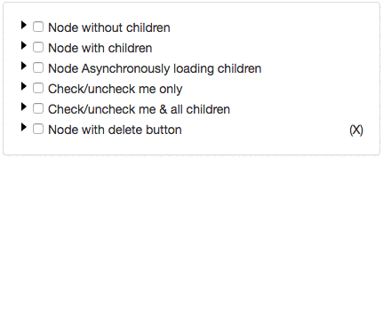
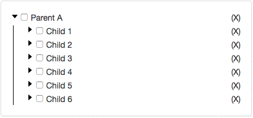

React Super Treeview
===

:clap: Finally, a React Treeview component which is customizable on every level.

Add/remove nodes, put your own animation, load data asynchronously, and even multi-select

## :star2: [See Demo w/ Example code](https://azizali.github.io/react-super-treeview/examples/)

**Gif feature demo**



**`shift + click` multi-select gmail-style**



## Full Features
- Expand/Collapse
- Checkbox
- Delete button
- Provide custom delete button
- Asynchronously load data
- Provide custom loading indicator
- Delete animation
- Unlimited nesting
- Granular control over when to show expand, checkbox or delete options
- Multi-select/unselect checkbox (shift + Check) like Gmail
- Control the node adding/delete animation speed

## How to install
`npm install react-super-treeview --save`

## Basic Usage

Start using the component in just 2 steps.

### Step 1: Import and use component in React:

```javascript
import React from 'react';
import ReactDOM from 'react-dom';
import SuperTreeview from 'react-super-treeview';

class Example extends React.Component {
    constructor(){
        super();
        // SET YOUR DATA
        this.state = {
            data: [
                {
                    id: 1,
                    name: 'Parent A'
                },
                {
                    id: 2,
                    name: 'Parent B',
                    isExpanded: true,
                    isChecked: true,
                    children: [
                        {
                            id: 1,
                            name: 'Child 1'
                        },
                        {
                            id: 2,
                            name: 'Child 2'
                        }
                    ]
                }
            ]
        };
    }

    render(){
        return (
            // RENDER THE COMPONENT
            <SuperTreeview
                data={ this.state.data }
                onUpdateCb={(updatedData) => {
                    this.setState({data: updatedData})
                }}
            />
        );
    }
}

ReactDOM.render(<Example/>, document.getElementById('app'););
```

### Step 2: Import styles to project

Import SuperTreeview styles with `css` or `scss` file.

The styles are in `node_modules/react-super-treeview/dist/style.css or style.scss`

Note: When you use the `scss` file, you can modify the style variables for quick styling.

#### Using webpack

If you are using webpack, put this in your project's styles.

```
~react-super-treeview/dist/style.css 
```
or `scss` 
```
~react-super-treeview/dist/style.scss
```

the tilda `~` tells webpack to pick-up the file from `node_modules` folder

#### Manually importing styles

You can also manually copy the `css`/`scss` file from `node_modules/react-super-treeview/dist/style.(s)css` and put it in your project files


## All Props
Required Props *

Props  | Type  | Default  | Description
--- | --- | --- | ---
`data` * | array | none | Data that will be displayed in the tree.
`onUpdateCb` * | function | none | Function callback when data gets changed (deleted, expanded/collapsed, checked/unchecked).
`depth` | number | `0` | Value that tracks the depth of the node tree. The root/highest depth is 0. Children nodes are depth+1 upto infinity.
`deleteElement`| element | `<div>(X)</div>`| Element that displays as the delete button.
`getStyleClassCb`| function | `(node, depth) => { return ' '; }` | Return the class name string you want to add on the node.
`isCheckable`| function | `(node, depth) => { return true; }`| Return `true/false` to show/hide checkbox on node.
`isDeletable`| function | `(node, depth) => { return true; }`| Return `true/false` to show/hide delete button on node.
`isExpandable`| function | `(node, depth) => { return true; }`| Return `true/false` to show/hide expand/collapse button (►) on node.
`keywordChildren`| string | `'children'`| Set the `key` where the component should look for the children elements.
`keywordChildrenLoading`| string| `'isChildrenLoading'`|Set the `key` that indicates if the children nodes are loading or now. If `true` then the `loadingElement` is shown. NOTE: Make sure that the node is expanded (`isExpanded: true`) for the `loadingElement`.
`keywordKey`| string | `'id'` | This is the value that is set as the `key` attribute on the node (`<div key={keywordKey}> node name </div>`). It defaults to the `id` key. This must be a unique key, if not provided or is not unique, will break the animation feature.
`keywordLabel`|string|`'name'` | The node text is printed from the `name` key. If you want some other key value to be printed, provide the key here.
`loadingElement`| element | `<div>loading...</div>`|Element that shows when data is being loading. Provide your custom loading element with this prop.
`noChildrenAvailableMessage` | string | `'no data found'` |Message that shows when the expanded node has no children.
`onCheckToggleCb`| function |`(arrayOfNodes, depth) => {}`|Function callback when checkbox gets toggled. The callback provides an array of nodes (`arrayOfNodes`) that got checked/unchecked. Since `<SuperTreeview />`  has a multi-select feature, hence its an array here. All nodes will have the same `isChecked` state, either `true` or `false`. The callback also provides the `depth` of the node that got checked/unchecked.
`onDeleteCb`|function|`(node, updatedData, depth) => { return true; }`|Function callback when node delete button gets clicked. The callback provides the `node` being deleted, its `depth`, and the updated data (`updatedData`) with the deleted node removed. Return `true` if you want to proceed with the deletion, and `false` if you do not want to delete the node. Returning `true` will trigger the `onUpdateCb()` prop, discussed below.
`onExpandToggleCb`|function| `(node, depth) => {}`|Function callback when node Expands/Collapses. The callback function provides the `node` that got toggled, and its `depth`.
`transitionEnterTimeout`|number|`1200`|Time in milliseconds for node appear animation.
`transitionExitTimeout`|number|`1200`|Time in milliseconds for node remove

## Data Format
```
[
    {
        id: 1,
        name: 'Any String',
        isExpanded: true,
        isChecked: true,
        isChildrenLoading: false
        children: [
            id: 2,
            name: 'Any String',
            isExpanded: true,
            isChecked: true,
            isChildrenLoading: true
            children: []
        ]
    }
];
```

## Test
```
npm test
```

## Shoutout
Shoutout to [Andrew Onyshchuk](https://github.com/oandrew) for suggesting a clean API exposing strategy.

Thank you [TJ Hubert](https://github.com/tjhubert) and [Prashanth Naika](https://github.com/pnaika) for your contribution to the animation feature and the bug fixes.


### TODO:

- [X] Bug: `keywordKey` prop is not being applied
- [ ] Feature: Make user friendly prop names for `keywordKey`, `keywordChildren` etc
- [ ] Performance: Remove the need for lodash
- [ ] Feature: Stretch goal: Add ability to add custom decorator/element per node
- [ ] Feature: Add css class on nodes based on its state i.e `<div class="expanded">Text</div>`
- [X] Feature: Provide .scss file with configurable variables
- [ ] Workflow: Provide auto-launch browser feature when examples are run with `npm run examples` 

### License

SuperTreeview is [MIT licensed](./LICENSE).
